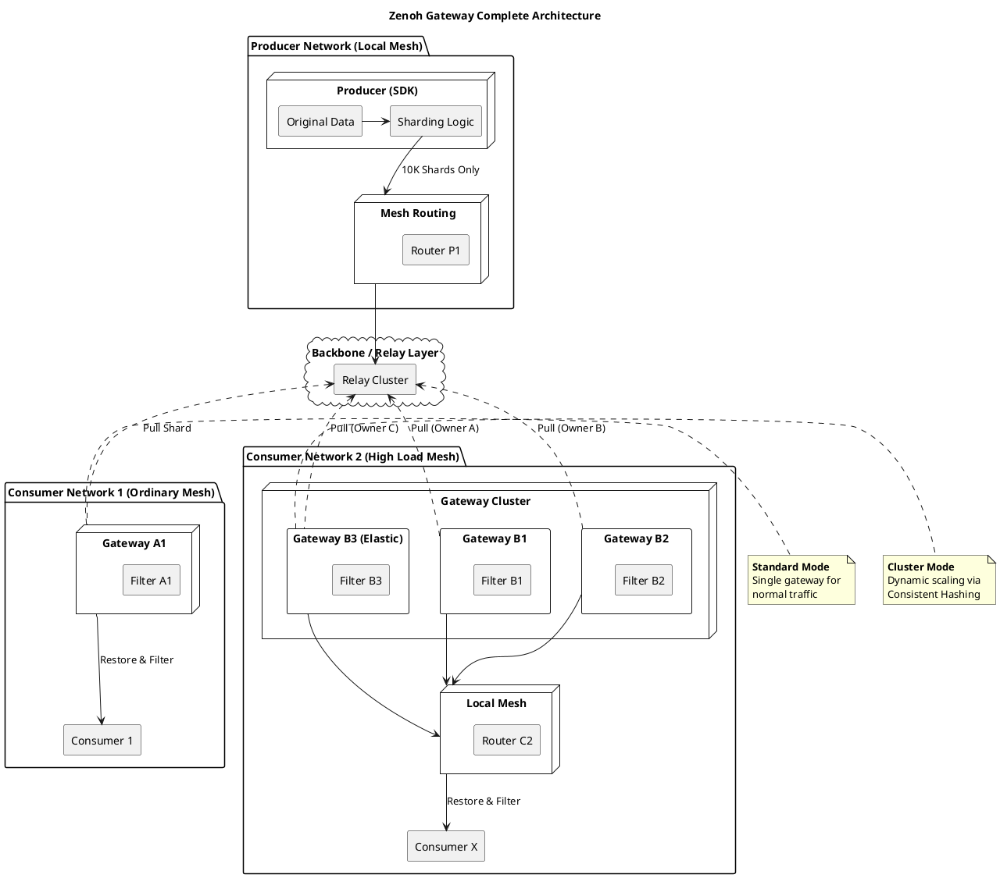

# Zenoh Gateway 方案分析报告

## 1. 背景与挑战总结
- **规模控制**：系统包含 2.3 万 Producer 和 **46,000** 个 Consumer，总 Topic 数达 4600 万。
- **源头分片 (Source Sharding)**：由 Producer 端 SDK 直接实现分片逻辑，将 46M Topic 哈希映射到 10,000 个聚合分片（`shard/p0-p9999`）。
- **透明分片机制**：通过 **Attachment** 携带原始 Key，使下游 Consumer 无需意识到分片存在。
- **核心价值**：保护 Producer Mesh 和主干网，将全局路由状态压制在 10k 以内。

## 2. 隔离网络内的负载均衡与精准转发
针对不同的隔离网络需求，设计了两种部署模式：

### 2.1 部署模式定义
- **单网关模式 (Standard Mode)**：适用于订阅压力正常的隔离网络（如 Gateway A1）。网关负责该网络所需的所有分片。
- **多网关集群模式 (Cluster Mode)**：适用于高负载隔离网络（如 B 集群）。通过部署多个网关，利用分布式算法分摊分片拉取与转发压力。

### 2.2 成员发现与仲裁 (针对集群模式)
- **集群化**：多个 Gateway 通过 Liveliness Token 自动组网，感知彼此状态。
- **一致性哈希 (Rendezvous Hashing)**：各 Gateway 自主计算分片所有权。确保任意分片在本地网格内有且仅有一个网关负责，避免重复拉取。

### 2.3 流程：从订阅到精准转发
1. **感知需求**：Gateway 实时监听本地 Mesh 内的订阅意向，维护“活动 Key 映射表”。
2. **所有权确认**：Gateway 判定自己是否为该分片的负责人（单网关模式下默认负责所有分片）。
3. **按需拉取**：仅当本地有需求时，负责该分片的 Gateway 才向上游拉取。
4. **精准过滤 (Interest Filtering)**：Gateway 解析 Attachment。**仅当原始 Key 在映射表中时才转发**，否则丢弃，防止分片内的“背景噪音”污染本地网格。
5. **还原分发**：在本地网格内按原始 Key 重新发布。

## 3. 架构图示：完整分发体系 (Source Sharding + Scaling + Filtering)

## 4. 最终结论与工程建议
1. **精准转发**：Gateway 必须实现基于本地兴趣的过滤逻辑，防止无效流量。
2. **弹性扩展**：通过 Rendezvous Hashing 支持 B 集群的无缝横向扩容。
3. **隔离性**：Gateway 严格执行路由防火墙策略，严禁原始订阅信息跨网污染。
4. **高性能实现**：建议在过滤转发环节使用 **Zero-copy** 技术和 Rust 等高性能语言。
