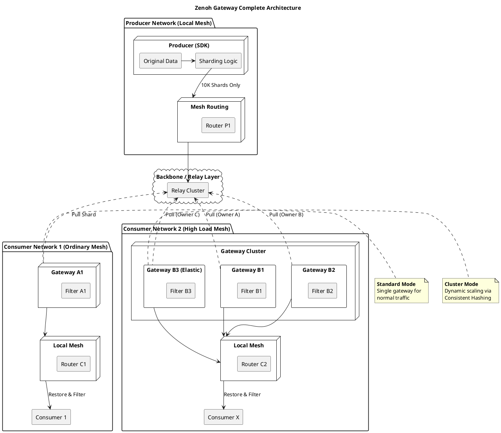

# Zenoh Gateway 設計案 分析報告

## 1. 背景と課題の要約
- **規模の制御**: システムは 2.3 万の Producer と **4.6 万** の Consumer で構成され、総 Topic 数は 4,600 万に達する。
- **送信元シャディング (Source Sharding)**: Producer 側の SDK でシャディング論理を直接実装し、集約シャード（`shard/p0-p9999`）に発行する。
- **透過的シャディング機構**: 原始の `key-expr` をメッセージの **Attachment** に付与し、業務レイヤーの透過性を維持する。
- **核心的価値**: 全てのルーティング・メッシュにおいて、ルート状態を 1 万件以内に抑える。

## 2. 隔離ネットワーク内での負荷分散と精緻な転送
隔離ネットワークの要件に応じて、以下の 2 つのデプロイメント・モードを設計する。

### 2.1 デプロイメント・モードの定義
- **シングル・ゲートウェイ・モード (Standard Mode)**: 購読プレッシャーが通常レベルの隔離ネットワーク（Gateway A1 等）に適している。当該ネットワークで必要な全シャードを担当する。
- **マルチ・ゲートウェイ・クラスタ・モード (Cluster Mode)**: 高負荷な隔離ネットワーク（B クラスタ等）に適している。複数の Gateway を配置し、分散アルゴリズムによってシャードのプルおよび転送負荷を分散する。

### 2.2 メンバーシップ検知と仲裁 (クラスタモード対象)
- **クラスタ化**: 複数の Gateway が Liveliness Token を用いて自律的に網を形成し、互いの状態を検知する。
- **一致性ハッシュ (Rendezvous Hashing)**: 各 Gateway がシャード所有権を自律計算する。任意のシャードに対し、ローカルメッシュ内で唯一の責任者を決定し、重複プルを防止する。

### 2.3 購読から「精緻な転送」までのフロー
1. **要求の検知**: Gateway はローカル Mesh 内の購読意向を監視し、「アクティブ Key マップ」を維持する。
2. **所有権確認**: 自身がそのシャードの Owner であるかを判定する（シングルモードの場合は全シャードを担当）。
3. **オンデマンド・プル**: ローカルで要求がある場合のみ、担当 Gateway が上流からプルする。
4. **精緻なフィルタリング (Interest Filtering)**: Attachment を解析し、**原始 Key がマップ内に存在する場合のみ** 転送する。それ以外は破棄し、メッシュ内の帯域を保護する。
5. **復元と配信**: ローカル Mesh 内で原始 Key として再発行する。

## 3. アーキテクチャ図：完全な配信体系 (Source Sharding + Scaling + Filtering)

## 4. 最終結論とエンジニアリング上の提言
1. **精緻な転送**: Gateway は必ずローカルの購読意向に基づくフィルタリングを実装し、無効なトラフィックを遮断すること。
2. **弾力的拡張**: Rendezvous Hashing により B クラスタのシームレスな水平拡張をサポートする。
3. **隔離性**: Gateway はルーティング・ファイアウォールとして機能し、ネットワーク間の独立性を担保する。
4. **ハイパフォーマンス実装**: フィルタリングと転送には **Zero-copy** 技術と Rust 等の高速な言語の使用を推奨する。
