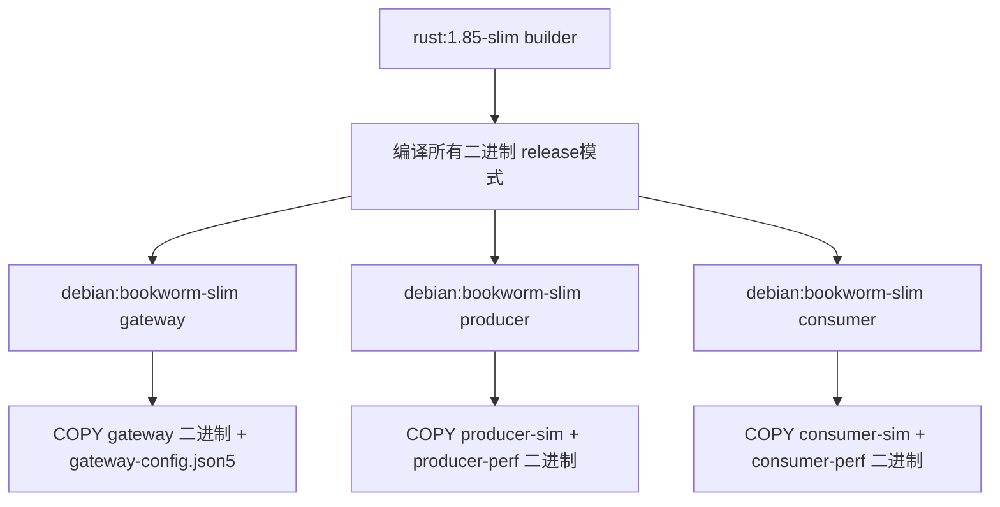
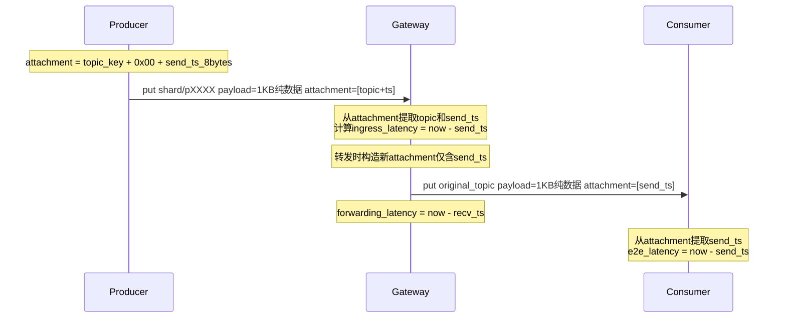
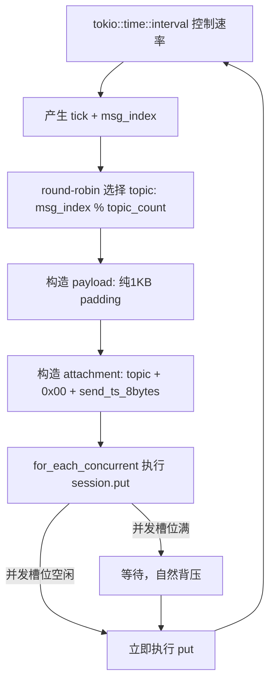

# K8s 性能测试准备计划

## 目标

在 K8s 环境中测试 Zenoh Gateway 的性能，需要完成 Docker 镜像制作、构建自动化、Gateway 配置化、可观测性增强、参数化 Producer/Consumer 五项工作。

---

## 1. Dockerfile — 多阶段构建

### 设计思路

采用**单一 Dockerfile + 多 target** 方案。所有二进制在同一个 builder stage 编译，然后通过不同的 final stage 产出 3 个镜像：

- `gateway` — 包含 gateway 二进制 + 默认配置文件
- `producer` — 包含 producer-sim 和 producer-perf 二进制
- `consumer` — 包含 consumer-sim 和 consumer-perf 二进制

### Dockerfile 结构



### 关键细节

- **Builder stage**: 使用 `rust:1.85-slim` 作为基础镜像，`cargo build --release` 编译全部二进制
- **Runtime stage**: 使用 `debian:bookworm-slim`，仅 COPY 对应二进制，不包含 Rust 工具链
- **Zenoh 依赖**: 运行时不需要 zenohd，Gateway/Producer/Consumer 各自通过 zenoh client 库连接
- **Gateway 镜像**: 额外 COPY `gateway-config.json5` 到 `/etc/zenoh-gateway/config.json5` 作为默认配置
- **构建命令**: `docker build --target gateway -t zenoh-gateway:latest .`

### 文件: `Dockerfile`

---

## 2. Makefile — 构建自动化

### Target 设计

| Target | 说明 |
|--------|------|
| `build` | `cargo build --release` |
| `image-gateway` | 构建 gateway 镜像 |
| `image-producer` | 构建 producer 镜像 |
| `image-consumer` | 构建 consumer 镜像 |
| `images` | 构建全部 3 个镜像 |
| `push` | 推送镜像到 REGISTRY |
| `clean` | cargo clean + docker 清理 |

### 可配置变量

```makefile
REGISTRY ?= your-registry.io
IMAGE_TAG ?= latest
```

镜像命名规则：
- `$(REGISTRY)/zenoh-gateway:$(IMAGE_TAG)`
- `$(REGISTRY)/zenoh-producer:$(IMAGE_TAG)`
- `$(REGISTRY)/zenoh-consumer:$(IMAGE_TAG)`

### 文件: `Makefile`

---

## 3. Gateway 配置化

### 问题

当前 [`src/main.rs:16-17`](src/main.rs:16) 硬编码 `zenoh::Config::default()` 创建 upstream/downstream session，在 K8s 中需要连接不同的 zenoh router 端点。

### 设计思路

- Gateway 使用 JSON5 配置文件（与项目已有的 [`router.json5`](router.json5) 风格一致）
- 配置文件内嵌 upstream/downstream 的 zenoh 连接端点
- 单文件方便 K8s ConfigMap 挂载
- Producer-perf / Consumer-perf 使用 `--zenoh-endpoint` CLI 参数（更轻量）

### 配置文件格式

**文件**: `gateway-config.json5`

> 注意：`id` 字段可选。多个 Gateway 共享同一 ConfigMap 时，不在配置文件中写死 ID，而是通过环境变量 `GATEWAY_ID` 注入。

```json5
{
  // Gateway 实例 ID（可选，优先级：GATEWAY_ID 环境变量 > CLI 参数 > 此字段 > 默认值 "gw-1"）
  "id": "gw-a",

  // Upstream zenoh session 配置（连接 Producer 侧 router）
  "upstream": {
    "connect": ["tcp/zenoh-upstream:7447"],
    "listen": []  // 可选，默认为空
  },

  // Downstream zenoh session 配置（连接 Consumer 侧 router）
  "downstream": {
    "connect": ["tcp/zenoh-downstream:7447"],
    "listen": []
  },

  // 集群发现和 Consumer 发现的 key expression
  "cluster_expr": "gateway/cluster/**",
  "consumer_liveliness_expr": "gateway/consumer/**",

  // 统计报告间隔（秒）
  "stats_interval_secs": 5
}
```

### 配置加载优先级

**配置文件路径**:
```
CLI --config <path>  >  环境变量 GATEWAY_CONFIG  >  默认值 /etc/zenoh-gateway/config.json5
```

**Gateway ID 优先级**（多 Gateway 共享 ConfigMap 的关键设计）:
```
GATEWAY_ID 环境变量  >  CLI 第一个位置参数  >  配置文件 id 字段  >  默认值 "gw-1"
```

- 如果没有任何配置文件，回退到 `zenoh::Config::default()`（保持本地开发兼容）
- CLI 用法: `gateway --config ./gateway-config.json5` 或 `gateway gw-a --config ./gateway-config.json5`
- K8s 中推荐用 `GATEWAY_ID` 环境变量 + Downward API，配置文件中不写死 ID

### 新建模块: `src/config.rs`

```rust
use serde::Deserialize;

#[derive(Debug, Deserialize)]
pub struct GatewayConfig {
    #[serde(default = "default_id")]
    pub id: String,
    pub upstream: ZenohEndpoints,
    pub downstream: ZenohEndpoints,
    #[serde(default = "default_cluster_expr")]
    pub cluster_expr: String,
    #[serde(default = "default_consumer_liveliness_expr")]
    pub consumer_liveliness_expr: String,
    #[serde(default = "default_stats_interval")]
    pub stats_interval_secs: u64,
}

#[derive(Debug, Deserialize)]
pub struct ZenohEndpoints {
    #[serde(default)]
    pub connect: Vec<String>,
    #[serde(default)]
    pub listen: Vec<String>,
}

impl GatewayConfig {
    /// 从文件加载配置
    pub fn from_file(path: &str) -> Result<Self, Box<dyn std::error::Error>>;

    /// 从环境变量 GATEWAY_CONFIG 加载，或使用默认路径
    pub fn load() -> Result<Self, Box<dyn std::error::Error>>;

    /// 解析最终的 Gateway ID（环境变量 > CLI > 配置文件 > 默认值）
    pub fn resolve_id(&self, cli_id: Option<&str>) -> String {
        std::env::var("GATEWAY_ID")
            .ok()
            .or_else(|| cli_id.map(|s| s.to_string()))
            .unwrap_or_else(|| self.id.clone())
    }

    /// 将 ZenohEndpoints 转换为 zenoh::Config
    pub fn to_zenoh_config(endpoints: &ZenohEndpoints) -> zenoh::Config;
}
```

### Cargo.toml 新增依赖

```toml
serde = { version = "1", features = ["derive"] }
serde_json5 = "0.1"   # JSON5 解析
tokio-stream = "0.1"  # IntervalStream + for_each_concurrent
```

> 注：如果 `serde_json5` 不可用或不够稳定，可退而使用 `serde_json` + 手动允许注释（strip comments 后 parse）。实际实现时根据 crate 生态选择。

### K8s 部署示例

> 多 Gateway 共享同一 ConfigMap，仅通过 `GATEWAY_ID` 环境变量区分实例。推荐使用 Downward API 将 Pod 名称注入为 Gateway ID。

```yaml
apiVersion: v1
kind: ConfigMap
metadata:
  name: gateway-config
data:
  config.json5: |
    {
      // 不写死 id，由 GATEWAY_ID 环境变量注入
      "upstream": { "connect": ["tcp/zenoh-upstream-service:7447"] },
      "downstream": { "connect": ["tcp/zenoh-downstream-service:7447"] }
    }
---
apiVersion: apps/v1
kind: Deployment
metadata:
  name: gateway
spec:
  replicas: 3  # 多个 Gateway 实例
  template:
    spec:
      containers:
      - name: gateway
        image: registry/zenoh-gateway:latest
        env:
        - name: GATEWAY_ID
          valueFrom:
            fieldRef:
              fieldPath: metadata.name  # Pod名称作为Gateway ID，如 gateway-7b8c9d-x2k4
        volumeMounts:
        - name: config
          mountPath: /etc/zenoh-gateway
      volumes:
      - name: config
        configMap:
          name: gateway-config
```

### 文件清单

| 文件 | 修改内容 |
|------|----------|
| `src/config.rs` | **新建** — GatewayConfig 结构体 + 加载逻辑 |
| `gateway-config.json5` | **新建** — 默认配置文件模板 |
| `src/lib.rs` | 添加 `pub mod config;` |
| `src/main.rs` | 用 `GatewayConfig` 替换硬编码的 `zenoh::Config::default()` |
| `Cargo.toml` | 添加 `serde` + JSON5 解析依赖 |

---

## 4. 可观测性 — 延迟测量

### 测量指标

| 指标 | 测量点 | 说明 |
|------|--------|------|
| **E2E Latency** | Producer → Consumer | 消息从 Producer 发出到 Consumer 收到的总时间 |
| **Gateway Forwarding Latency** | Gateway 内部 | 从 Gateway 收到 upstream 消息到完成 downstream put 的时间 |
| **Gateway Ingress Latency** | Producer → Gateway | 消息从 Producer 发出到 Gateway 收到的时间 |
| **Message Count** | Gateway / Consumer | 每秒处理/接收的消息数 |

### 数据流与时间戳传递

> **关键设计决策**：时间戳通过 Zenoh Attachment 传递，而非嵌入 payload。这样 payload 保持纯 1KB，与历史测试结果可比。



### Attachment 编码格式

**Producer → Gateway**（需要同时携带 topic key 和时间戳）:
```
[topic_key_bytes][0x00 separator][8 bytes: send_timestamp_nanos BE]
```
- `0x00` 作为分隔符，将 topic key 和时间戳分开
- Gateway 从 attachment 中提取 topic key（用于 interest 查找）和 send_ts（用于延迟计算）

**Gateway → Consumer**（topic 已在 key expression 中，仅需时间戳）:
```
[8 bytes: send_timestamp_nanos BE]
```
- Consumer 从 attachment 提取 send_ts，计算 E2E latency

**当前代码变更点**:
- [`src/producer_sim.rs:60`](src/producer_sim.rs:60): 现有 `.attachment(topic.as_bytes())` → 改为 `.attachment([topic, 0x00, send_ts])`
- [`src/forwarding.rs:39-48`](src/forwarding.rs:39): 现有从 attachment 提取 topic → 增加提取 send_ts，转发时构造新 attachment 携带 send_ts

### 新建模块: `src/metrics.rs`

```rust
pub struct MetricsCollector {
    msg_count: AtomicU64,           // 消息计数
    latency_samples: Mutex<Vec<u64>>, // 延迟采样（纳秒）
}

impl MetricsCollector {
    pub fn new() -> Self;
    pub fn record_message(&self);                    // msg_count += 1
    pub fn record_latency(&self, latency_ns: u64);   // 记录延迟样本
    pub fn snapshot_and_reset(&self) -> MetricsSnapshot; // 获取统计并重置
}

pub struct MetricsSnapshot {
    pub msg_count: u64,
    pub latency_min_ns: u64,
    pub latency_max_ns: u64,
    pub latency_avg_ns: u64,
    pub latency_p50_ns: u64,
    pub latency_p90_ns: u64,
    pub latency_p99_ns: u64,
}
```

### 修改文件清单

| 文件 | 修改内容 |
|------|----------|
| `src/metrics.rs` | **新建** — MetricsCollector 和 MetricsSnapshot |
| `src/lib.rs` | 添加 `pub mod metrics;` |
| `src/forwarding.rs` | 注入 `MetricsCollector`；从 attachment 提取 send_ts 计算 ingress latency；转发时构造新 attachment 携带 send_ts；记录 forwarding latency |
| `src/main.rs` | 创建 `MetricsCollector` 实例，注入到 `ForwardingHandler`，在周期性统计任务中输出延迟报告 |
| `src/consumer_sim.rs` | 从 attachment 提取 send_ts，计算 E2E latency，用 `MetricsCollector` 记录 |
| `src/producer_sim.rs` | attachment 从纯 topic 改为 `[topic + 0x00 + send_ts]`（保持向后兼容） |

### Gateway 延迟报告格式示例

```
--- Metrics [gw-a] ---
Messages Forwarded: 12345 (2469/s)
Forwarding Latency: min=15us max=892us avg=45us p50=38us p90=72us p99=156us
Ingress Latency (send→recv): min=1020us max=5230us avg=2100us p50=1850us p90=3200us p99=4800us
------------------------
```

### Consumer 延迟报告格式示例

```
--- Consumer Metrics [c1] ---
Messages Received: 9876 (1975/s)
E2E Latency: min=1200us max=8900us avg=3200us p50=2800us p90=5200us p99=7800us
------------------------
```

---

## 5. 参数化 Producer — `producer-perf`

### 设计思路

新建 `producer-perf` 二进制，不修改原有 `producer-sim`，保持向后兼容。通过参数指定 topic 数量，自动生成 topic，无需文件。

### 命令行接口

```bash
producer-perf <topic-count> <msgs-per-sec> [options]

# 示例
producer-perf 2000 5000              # 2000个topic，每秒5000条消息
producer-perf 2000 5000 --prefix perf/topic   # 自定义topic前缀
producer-perf 2000 5000 --payload-size 256    # 自定义payload大小（字节）
producer-perf 2000 5000 --zenoh-endpoint tcp/zenoh:7447  # 指定zenoh连接端点
```

### 参数说明

| 参数 | 必选 | 说明 |
|------|------|------|
| `topic-count` | 是 | 自动生成的 topic 数量（无需文件） |
| `msgs-per-sec` | 是 | 目标发送速率（条/秒） |
| `--prefix` | 否 | Topic 前缀，默认 `perf/topic` |
| `--payload-size` | 否 | Payload 大小，默认 1024 字节（1KB），与历史测试一致便于对比 |
| `--workers` | 否 | 并发发送 worker 数，默认 = CPU 核心数 |
| `--zenoh-endpoint` | 否 | Zenoh 连接端点，默认 `tcp/localhost:7447` |

### 发送策略 — 有界并发流水线

> 单线程 `session.put().await` 在高速率下会成为瓶颈。采用 **`for_each_concurrent`** 模式：定时器控制速率，固定并发度限制 in-flight 请求数，避免无界 spawn。



- Topic 命名: `{prefix}-{0..topic_count-1}`，例如 `perf/topic-0`, `perf/topic-1999`
- 发送顺序: round-robin 轮询所有 topic
- **速率控制**: `tokio::time::interval` + `MissedTickBehavior::Delay`，防止 tick 堆积
- **有界并发**: `for_each_concurrent(workers)` 限制最多 N 个并发 put
  - 不会无界 spawn task，内存可控
  - 所有并发槽位忙时自然背压，不压垮 zenoh session
  - `--workers` 参数控制并发度，默认 = CPU 核心数
- Payload: 纯 `payload-size` 字节 padding（默认 1KB），时间戳通过 attachment 传递
- Attachment: `[topic_key_bytes][0x00][8 bytes send_ts_ns BE]`

### 核心代码结构

```rust
use tokio_stream::wrappers::IntervalStream;
use tokio_stream::StreamExt;

let interval = tokio::time::interval(Duration::from_nanos(1_000_000_000 / msgs_per_sec));
interval.set_missed_tick_behavior(MissedTickBehavior::Delay);

IntervalStream::new(interval)
    .enumerate()
    .for_each_concurrent(workers, |(i, _)| {
        let session = session.clone();
        let topics = topics.clone();
        async move {
            let topic_index = i % topic_count;
            let topic = &topics[topic_index];
            let shard_id = hashing::get_shard_id(topic);
            let send_ts = now_ns();
            let attachment = encode_attachment(topic, send_ts);
            let payload = vec![0u8; payload_size];
            let _ = session.put(&*shard_id, payload)
                .attachment(&attachment)
                .await;
        }
    })
    .await;
```

### 文件清单

| 文件 | 修改内容 |
|------|----------|
| `src/producer_perf.rs` | **新建** — 参数化 Producer |
| `Cargo.toml` | 添加 `[[bin]] name = "producer-perf" path = "src/producer_perf.rs"` |

---

## 6. 参数化 Consumer — `consumer-perf`

### 设计思路

新建 `consumer-perf` 二进制，与 `producer-perf` 配对使用。通过参数指定 topic 数量，自动生成 topic，无需文件。同时集成 E2E 延迟测量。

### 命令行接口

```bash
consumer-perf <client-id> <topic-count> [options]

# 示例
consumer-perf c1 2000                # client-id=c1，订阅2000个topic
consumer-perf c1 2000 --prefix perf/topic   # 与producer-perf相同的topic前缀
consumer-perf c1 2000 --zenoh-endpoint tcp/zenoh:7447  # 指定zenoh连接端点
```

### 参数说明

| 参数 | 必选 | 说明 |
|------|------|------|
| `client-id` | 是 | Consumer 的客户端 ID |
| `topic-count` | 是 | 自动生成的 topic 数量（无需文件） |
| `--prefix` | 否 | Topic 前缀，默认 `perf/topic`，需与 producer-perf 一致 |
| `--zenoh-endpoint` | 否 | Zenoh 连接端点，默认 `tcp/localhost:7447` |

### Topic 生成规则

与 `producer-perf` 完全一致：`{prefix}-{0..topic_count-1}`，确保 Producer 和 Consumer 的 topic 集合匹配。

### 功能

1. 自动生成 topic 列表并订阅
2. 提供 Queryable 回复 interest 列表（与 consumer-sim 相同机制）
3. 声明 Liveliness Token
4. 从 payload 前 8 字节提取 send_ts，计算 E2E latency
5. 周期性输出延迟统计报告

### 文件清单

| 文件 | 修改内容 |
|------|----------|
| `src/consumer_perf.rs` | **新建** — 参数化 Consumer + E2E 延迟测量 |
| `Cargo.toml` | 添加 `[[bin]] name = "consumer-perf" path = "src/consumer_perf.rs"` |

---

## 实施顺序

1. **src/config.rs + gateway-config.json5** — Gateway 配置化（其他模块的基础）
2. **src/metrics.rs** — 可观测性基础模块
3. **src/producer_perf.rs + Cargo.toml** — 新 Producer
4. **src/consumer_perf.rs + Cargo.toml** — 新 Consumer
5. **修改 forwarding.rs / main.rs / consumer_sim.rs / producer_sim.rs / lib.rs** — 集成 config + metrics
6. **Dockerfile** — 镜像制作
7. **Makefile** — 构建自动化

---

## 文件变更总览

| 操作 | 文件 |
|------|------|
| 新建 | `Dockerfile` |
| 新建 | `Makefile` |
| 新建 | `src/config.rs` |
| 新建 | `gateway-config.json5` |
| 新建 | `src/metrics.rs` |
| 新建 | `src/producer_perf.rs` |
| 新建 | `src/consumer_perf.rs` |
| 修改 | `Cargo.toml` — 添加 serde 依赖 + producer-perf/consumer-perf bin target |
| 修改 | `src/lib.rs` — 添加 `pub mod config; pub mod metrics;` |
| 修改 | `src/main.rs` — 用 GatewayConfig 替换硬编码 + 集成 MetricsCollector |
| 修改 | `src/forwarding.rs` — 注入 MetricsCollector，记录 forwarding latency |
| 修改 | `src/consumer_sim.rs` — 提取 send_ts，计算 E2E latency |
| 修改 | `src/producer_sim.rs` — payload 嵌入 send_ts |
